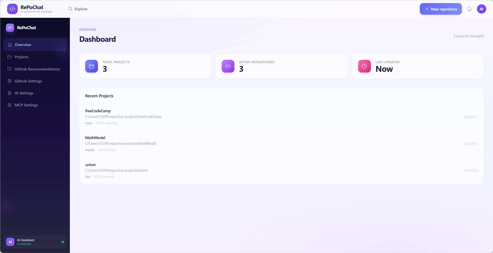
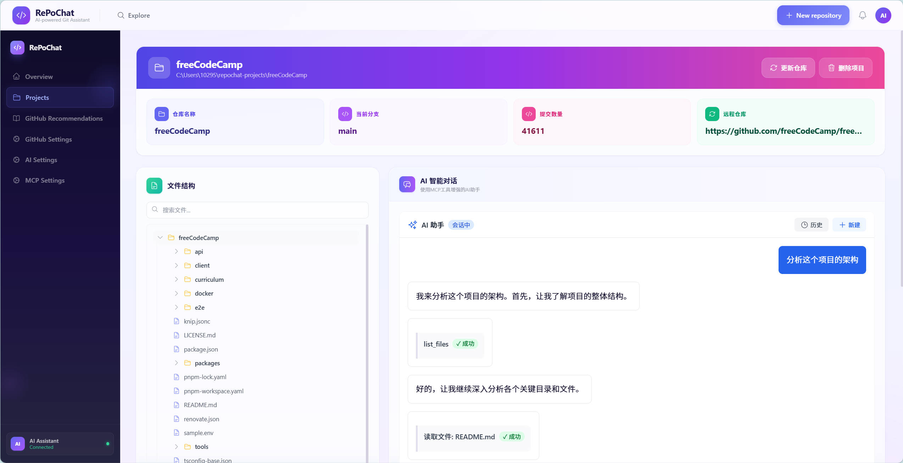
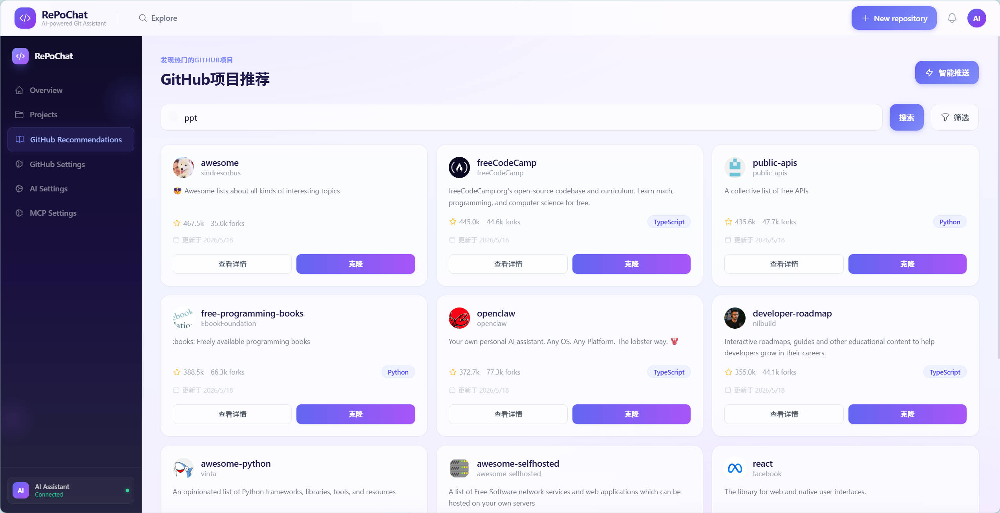
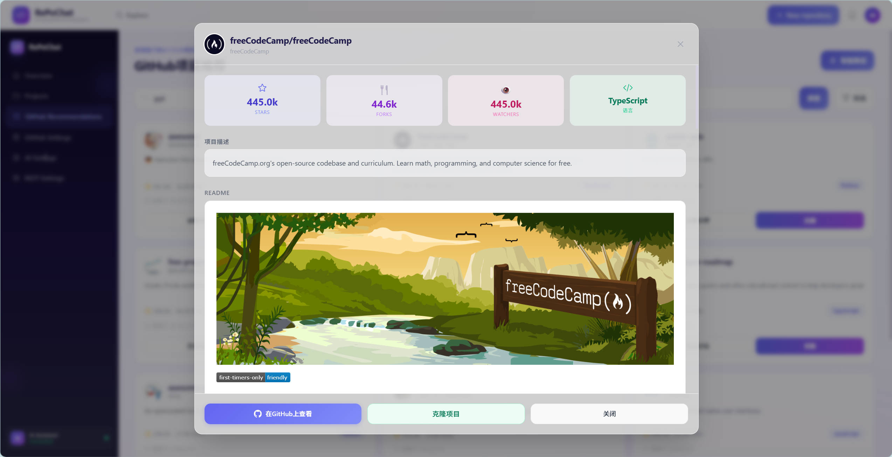

# RePoChat — 用聊天的方式读懂任何代码仓库

RePoChat 是一个 AI 驱动的 Git 仓库分析工具。克隆一个仓库，然后像跟同事聊天一样向 AI 提问——"这个项目做了什么事？""数据库表结构在哪定义的？""认证逻辑是怎么写的？"——AI 会直接阅读你的代码并给出答案，不用再一个文件一个文件地翻。

界面采用深紫渐变侧边栏搭配毛玻璃卡片的玻璃态科技风设计，靛蓝、紫罗兰、粉红三色体系贯穿全局，干净利落。



---

## 打开之后怎么用

### 第一步：配置 AI 提供商

点左侧边栏的「AI 设置」，选择一个 AI 服务商（OpenAI、Claude、DeepSeek、Gemini、Kimi 都支持），填上 API Key，点「测试连接」确认通了，再点「保存设置」。

### 第二步：克隆一个仓库

点左侧「项目」→「克隆仓库」，把 GitHub 上任意仓库的 URL 贴进去（比如 `https://github.com/vuejs/core.git`），点克隆。几秒钟后仓库就下载到本地了，点「查看详情」进入项目。

### 第三步：跟 AI 聊你的代码

进入项目详情页后，右侧就是 AI 对话框。你可以问它：

- *"这个项目的整体架构是什么样的？"*
- *"用户登录的逻辑在哪几个文件里？"*
- *"帮我解释一下 src/main.ts 里做了什么"*
- *"这个项目用了哪些第三方依赖？"*

AI 会自动翻看文件树、读取关键代码、搜索相关内容，然后给出有来龙去脉的回答，不是那种泛泛而谈的套话。



---

## 其他实用功能

### GitHub 项目推荐

不知道该看什么项目？点「GitHub 推荐」，系统会展示 GitHub 上的热门仓库。也可以用顶部的搜索框按语言、更新时间筛选，找到感兴趣的项目后一键克隆到本地。



### 查看项目详情再决定

在推荐页看到感兴趣的项目，先点「查看详情」——会弹出项目的 Stars、Forks、README 等信息，确认值得一看再克隆。还可以直接跳转到 GitHub 原仓库。



### MCP 服务器扩展

在「MCP 设置」里可以接入 MCP 协议工具，扩展 AI 的能力——比如让它读写文件、执行终端命令、查询数据库等。支持手动配置，也可以从剪贴板一键导入 JSON 配置。

### 对话历史回溯

每次跟 AI 的对话都会自动保存。点聊天面板右上角的「历史」按钮，可以按收藏、时间、消耗 token 数来搜索和筛选之前的对话，随时翻出来再看。

---

## 项目结构

```
RePoChat/
├── backend/                 # Python FastAPI 后端
│   └── app/
│       ├── api/routes/      # REST API 路由
│       ├── core/            # AI管理、Git管理、MCP服务
│       ├── models/          # 数据库模型
│       └── services/        # 业务服务层
├── frontend/                # React + TypeScript 前端
│   └── src/renderer/
│       ├── components/      # 页面和布局组件
│       ├── services/        # API 调用层
│       └── styles/          # 样式文件
└── docs/                    # 文档和截图
```

---

## 本地运行

### 你需要有

- **Python 3.8+** 和 **Node.js 16+**
- 至少一个 AI 服务商的 API Key

### 安装步骤

**1. 后端**

```bash
cd backend

# 创建虚拟环境
python -m venv venv

# 激活虚拟环境
# Windows:
venv\Scripts\activate
# Mac / Linux:
source venv/bin/activate

# 安装依赖
pip install -r requirements.txt
```

**2. 配置 API Key**

复制 `.env.example` 为 `.env`，填上你要用的 AI 服务商 Key：

```
OPENAI_API_KEY=你的OpenAI_Key
ANTHROPIC_API_KEY=你的Claude_Key
DEEPSEEK_API_KEY=你的DeepSeek_Key
```

不用的服务商 Key 留空就行，不用全填。

**3. 前端**

```bash
cd frontend
npm install
```

**4. 启动**

```bash
# 回到项目根目录
npm run dev
```

浏览器打开 `http://localhost:5173` 就能用了。

---

## 常见问题

**Q：克隆仓库时报「目录已存在」？**

A：说明你之前已经克隆过这个仓库了，系统会自动接管已有的本地文件夹，不会重复克隆。

**Q：重启之后项目列表空了？**

A：已修复。现在克隆的仓库会持久化到数据库，重启不会丢失。而且启动时会自动扫描默认目录下的 Git 仓库并接管。

**Q：支持哪些 AI 模型？**

A：OpenAI（GPT-4o 等）、Anthropic（Claude 3.5/3.7 Sonnet）、Google Gemini（2.5 Pro/Flash）、DeepSeek（Chat/Reasoner）、Moonshot（Kimi 系列）。你也可以在 AI 设置里填入自己的代理地址。

**Q：我的代码安全吗？**

A：所有代码都留在你的本地机器上，只有你提问时 AI 需要的那部分代码会被发送到你配置的 AI 服务商。不会上传到第三方服务器。

---

## License

MIT
